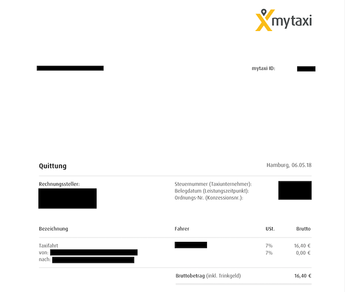
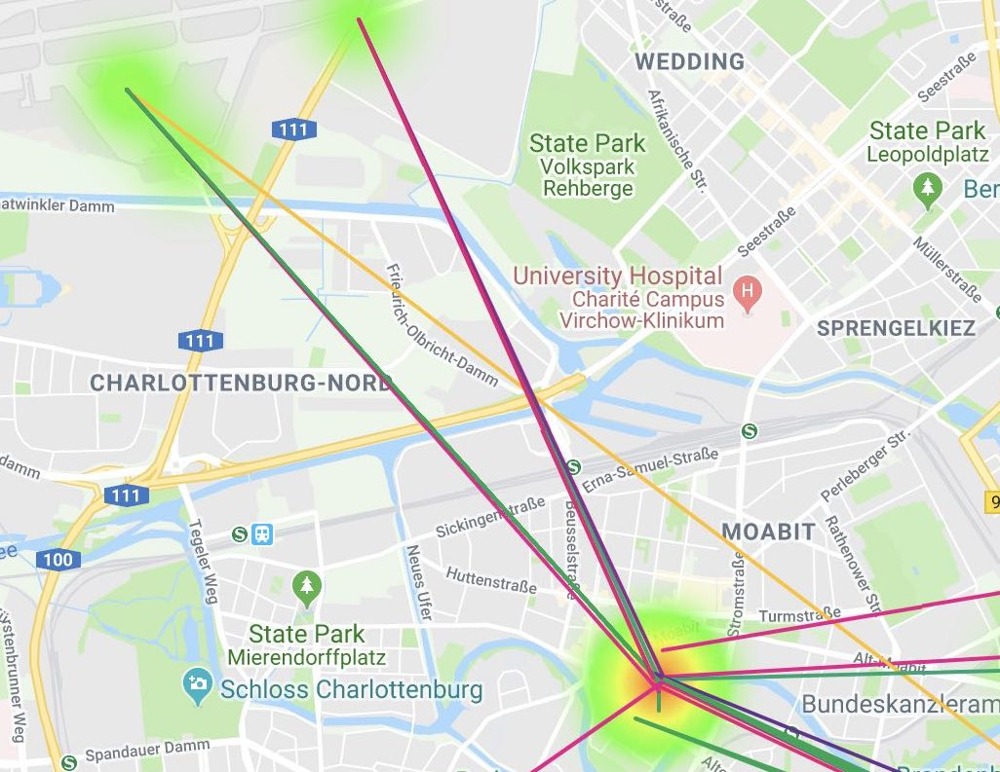

# mytaxi-scraper
*A tool that scrapes metadata out of mytaxi receipt pdfs.*

## Problem
If you use taxis a lot in germany, and use mytaxi for this purpose, these receipts will appear familiar to you:




This tool extracts meta information from these PDF receipts for further analysis

## Usage

### Extract data

1. Make sure you have python3
2. Install `pdfminer.six` (`pip3 install pdfminer.six`)
3. Prepare a directory that contains your pdf files
4. `python3 write_json.py <<path/to/directory/with/trailing/slash/>>`
5. You have a `metadata.json` file with the metadata for all your taxi rides


### Create a heatmap of your visited spots



Make sure to obtain a Google Maps API key.
Set the environment variable:

`export GMAPS_API_KEY=<<Your API Key>>`

Exactly as the extract script, but
`python3 analyze.py <<path/to/directory/with/trailing/slash/>>`

The script uses Google Maps API to find the coordinates of the addresses of your rides. Once it has done that, it stores the results of the pdf parsing and the location queries in a pickle file. If you want to refresh the data, just delete the pickle file.
The script will produce an `html` file with a google map of your rides and hotspots.


### Use as library in your own program
Copy the file `extract.py` into your python project, then:

```
from extract import parse_bill

metadata = parse_bill('path/to/my/bill.pdf')
print(metadata) 

```
